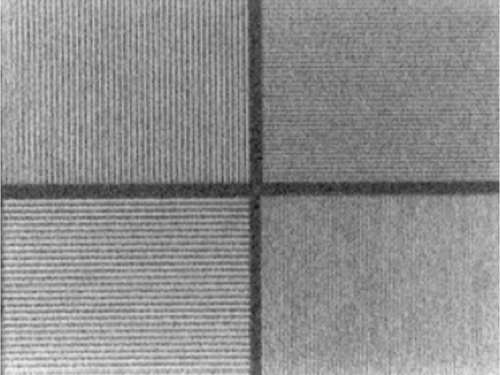
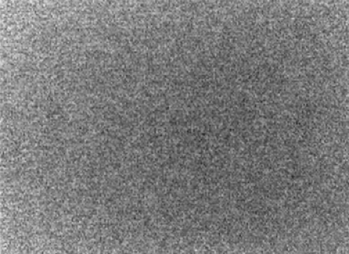
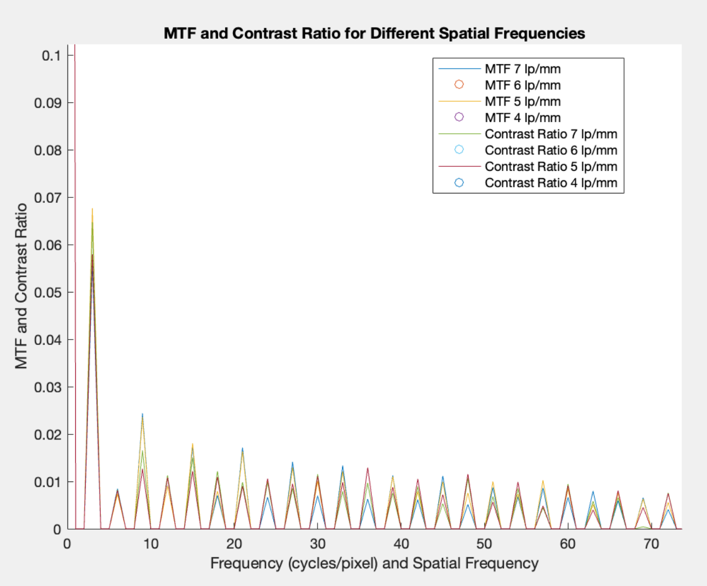
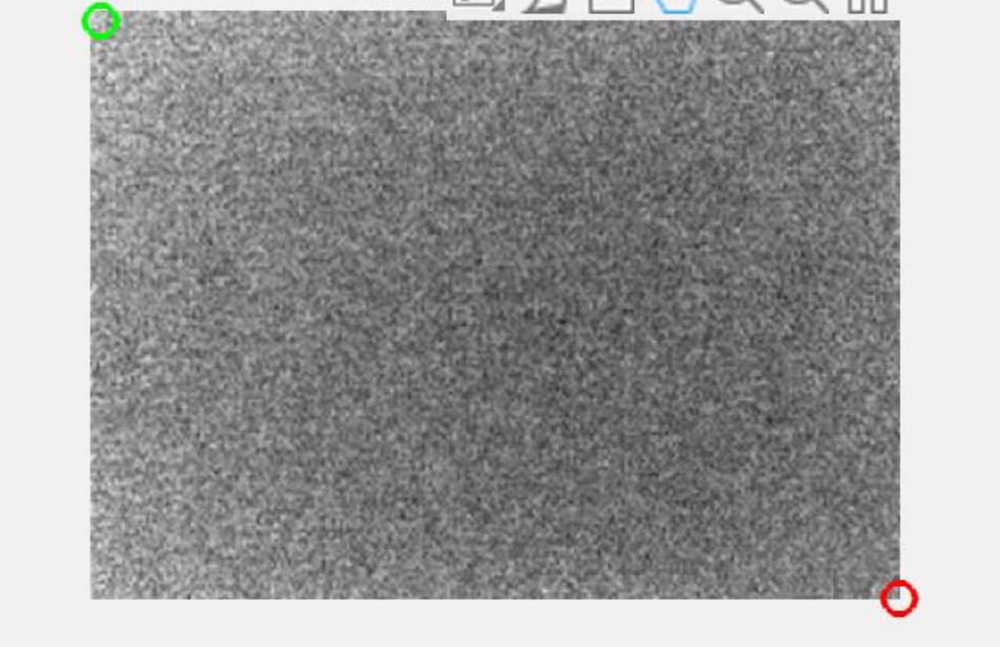

# Mtf Homegeneity Analysis
## Project Overview
This project implements quality control analysis techniques for nuclear medicine imaging systems using MATLAB. The workflow focuses on the evaluation of Modulation Transfer Function (MTF) and image homogeneity, two fundamental metrics used to assess the spatial resolution and uniformity of gamma camera systems.

---

## Methodology
The project includes:
1. Loading gamma camera phantom images
2. Computing image profiles for different spatial frequenncies
3. Estimating the Modulation Transfer Function (MTF)
4. Calculating contrast ratios for multiple line-pair frequencies
5. Performing homogeneity analysis using 13x13 averaging kernel
6. Detecting minimum and maximum intensity regions
7. Quantifying image uniformity using homogeneity metrics
8. Visualizing quantitative quality control results

---

## Sample Results
### Gamma Camera Phantom Image
The original gamma camera phantom image used for Modulation Transfer Function (MTF) analysis.

### Homogeneity Image
Uniformity phantom image used for homogeneity evaluation and quality control measurements.

### MTF and Contrast Ratio Analysis
The calculated Modulation Transfer Function (MTF) curves and contrast ratios for different spatial frequencies demonstrate the spatial resolution characteristics of the gamma camera imaging system.

### Intesity Range Vizualization
Visualization of the detected minimum (Amin) and maximum (Amax) intensity locations used for image homogeneity assessment after applying a 13x13 averaging filter.

---

## Technologies
- MATLAB
- Medical Image Processing
- Image Quality Assessment
- Signal Processing
- Modulation Transfer Function (MTF)
- Homogeneity Analysis
- Gamma Camera Quality Control
  
---

## Dataset
The project uses gamma camera phantom imgaes for quality control analysis. The input images are provides in the `data/` folder.

---

## Applications
This project is relevant to:
- Nuclear Medicine
- Medical Imaging
- Gamma Camera Quality Control
- Biomedical Image Analysis
- Image Quality Assessment
- Signal Processing
